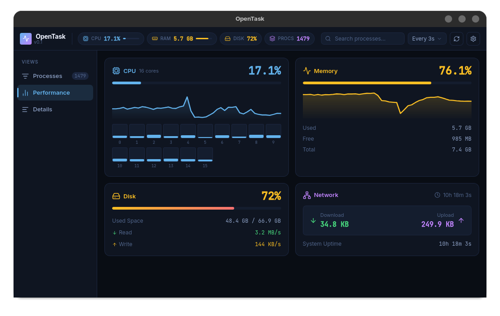

# OpenTask

OpenTask is a lightweight, cross-platform system monitoring and process management application built using Rust, Tauri 2, React, and TypeScript. Designed as a modern alternative to traditional task managers, OpenTask provides real-time system resource visualization and comprehensive process signal controls with minimal resource overhead.

<p align="center">
  
</p>

## Architecture and Technology Stack

- Frontend: React 18, TypeScript, Vite, Vanilla CSS
- Backend: Rust, Tauri v2, sysinfo
- Icons: Lucide React

## Functionality and Key Features

### Process Management
- Process Control Signals: Gracefully terminate processes (SIGTERM), forcibly kill processes (SIGKILL), pause/suspend process threads (SIGSTOP), or resume suspended processes (SIGCONT).
- Process Restart: Safely stop and re-launch processes using their original binary execution arguments.
- Context Menu: Right-click any process row across the Processes and Details tabs to access signal commands and navigation shortcuts.
- Force Kill Safety Confirmation: Modal dialog prevents accidental execution of SIGKILL and warns of potential unsaved data loss.
- Process Search and Sorting: Filter processes by PID or process name, with multi-column sorting for CPU usage, memory consumption, PID, and process status.

### Performance Monitoring
- Live Graphs: Auto-scaling sparkline charts displaying real-time metrics for CPU, Memory, Disk I/O, and Network traffic.
- Per-Core CPU Breakdown: Visual load representation across individual CPU cores.
- Adjustable Sampling Rates: Configurable polling intervals (1s, 2s, 3s, 5s, 10s, or Manual refresh).

### Process Details View
- Detailed Process Inspection: Comprehensive breakdown of running applications including full command-line invocation strings, memory footprint, and exact CPU consumption.

## Installation and Usage

### Prerequisites

Ensure the following prerequisites are installed on your system:
- Node.js (v18 or higher) and npm
- Rust toolchain (cargo, rustc)
- Linux System Dependencies (required for WebKit GTK webviews):
  ```bash
  sudo apt install build-essential curl wget libssl-dev libgtk-3-dev libwebkit2gtk-4.1-dev libayatana-appindicator3-dev librsvg2-dev
  ```

### Running OpenTask

1. Clone the repository:
   ```bash
   git clone https://github.com/Avijit-Sarkar/OpenTask.git
   cd OpenTask
   ```

2. Install JavaScript dependencies:
   ```bash
   npm install
   ```

3. Start the application in development mode:
   ```bash
   cargo tauri dev
   ```

### Building for Production

To compile a standalone production binary and system package (.deb, AppImage):

```bash
cargo tauri build
```

The compiled executable and distribution packages will be output to `src-tauri/target/release/bundle/`.

## Developer Instructions

### Project Structure

```
OpenTask/
├── src/                      # Frontend application code (React + TypeScript)
│   ├── components/           # UI Components (ProcessList, PerformanceView, ContextMenu, ConfirmModal, etc.)
│   ├── utils/                # Formatting utilities and metrics helpers
│   ├── types.ts              # Shared TypeScript interfaces
│   ├── App.tsx               # Primary application state and layout manager
│   └── main.tsx              # React application entry point
├── src-tauri/                # Native backend application code (Rust + Tauri)
│   ├── src/
│   │   ├── main.rs           # Tauri binary runner
│   │   └── lib.rs            # Backend logic, sysinfo telemetry, and IPC handlers
│   ├── Cargo.toml            # Rust package dependencies and metadata
│   └── tauri.conf.json       # Tauri window management and build configuration
└── package.json              # Frontend dependencies and script definitions
```

### IPC Commands (Rust Handlers)

The frontend communicates with the Rust backend via Tauri IPC (`invoke`):

- `get_system_stats`: Fetches system-wide resource metrics (CPU, Memory, Disk, Network) and process telemetry.
- `send_process_signal`: Issues POSIX signals (`term`, `kill`, `stop`, `continue`) to a target process ID.
- `restart_process`: Sends SIGTERM to the specified PID and spawns a new process instance using its command-line arguments.
- `kill_process`: Endpoint for process termination requests.

### Quality Assurance and Type Checking

To verify TypeScript types across the project:
```bash
npx tsc --noEmit
```

To build the production frontend assets:
```bash
npm run build
```

## License

This project is open-source and released under the MIT License.
